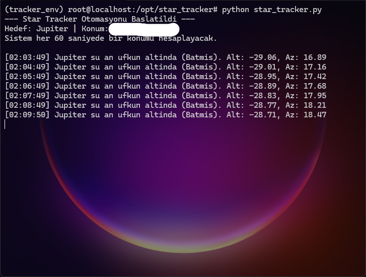

# 🌌 Autonomous Star Tracker & Linux Tablet Server

An autonomous tracking system that repurposes an old Android tablet into a Linux-based ground control station. It continuously calculates the real-time positions of celestial bodies (like Venus, Jupiter) and physically tracks them using a custom 2-axis (Pan-Tilt) motor mechanism.

> **Status:** Work in Progress 🚧 (Software and Server architecture completed, hardware integration ongoing.)

---

## 🚀 Project Objectives
This project tackles two main engineering challenges:
1. **Repurposing Hardware:** Hacking/rooting an unused Android tablet via "Linux Deploy" to create a 24/7 SSH server and computational brain.
2. **Autonomous Targeting:** Utilizing open-source astronomy libraries (Skyfield) to calculate real-time planetary positions and building an autonomous tracking mechanism with Arduino and DC Geared Motors.

---

## 🛠️ Tech Stack & Hardware

### Software & Communication
* **OS:** Linux (Chroot environment on Android)
* **Languages & Libs:** Python 3, Skyfield (Astronomy), PySerial (Serial Communication)
* **Dataset:** NASA JPL `de421.bsp` (Solar System Ephemeris Data)
* **MCU Software:** Arduino IDE (C++)

### Hardware
* **Server/Brain:** Old Android Tablet (Rooted)
* **Controller:** Arduino Nano 
* **Motor Driver:** L298N Dual Motor Driver Board
* **Actuators:** 2x DC Geared Motors ("Yellow Motors" for Pan/Tilt mechanism)
* **Power:** 5V Powerbank (For fully autonomous operation)

---

## 🧠 How the System Works

To achieve precise positioning using motors *without* hardware encoders, a time-based relative movement algorithm was developed:

1. **Calculation:** Python uses the `Skyfield` library to calculate the target's (e.g., Jupiter) real-time Altitude and Azimuth angles relative to the local horizon.
2. **Communication:** The calculated target angles are sent to the Arduino via USB (Serial Port).
3. **Relative Movement Logic (Memory Hack):** 
   * Since the DC motors lack encoders, the Arduino stores its current position in a memory variable (`current_position`).
   * If the target is 77° and the current position is 30°, the Arduino only drives the motor for the difference (+47°).
4. **Time-based Actuation:** The angle difference is multiplied by a calibrated time constant (e.g., 1 degree = 100 ms) to ensure the motors run for the exact required duration.

---

## 📸 Media & Testing

*(Photos of the setup and a short GIF of the tracking mechanism in action will be added here)*

* **Image 1:** Real-time Jupiter targeting data from the Linux terminal.

  
* **Image 2:** Wiring diagram of the Arduino, L298N, and DC motors.

graph TD
    subgraph Power
        PB[5V Powerbank]
    end

    ```subgraph Controller
        Nano[Arduino Nano]
    end

    subgraph Driver
        L298N[L298N Motor Driver]
    end

    subgraph Actuators
        M1((DC Motor 1 - Pan / Azimuth))
        M2((DC Motor 2 - Tilt / Altitude))
    end

    %% Power Connections
    PB -->|5V & GND| Nano
    PB -->|5V & GND| L298N

    %% Data Connections (Arduino to Driver)
    Nano -->|D5, D6 to IN1, IN2| L298N
    Nano -->|D9, D10 to IN3, IN4| L298N
    ```

    %% Motor Connections
    L298N -->|OUT1, OUT2| M1
    L298N -->|OUT3, OUT4| M2
* **GIF:** The system autonomously orienting towards Venus.

---

## 💡 Future Roadmap
* [ ] Upgrade from DC motors to Stepper Motors for micro-degree precision.
* [ ] Integrate a camera and implement OpenCV for visual targeting/centering.
* [ ] Develop a lightweight Web UI hosted on the tablet to select celestial targets via smartphone.
